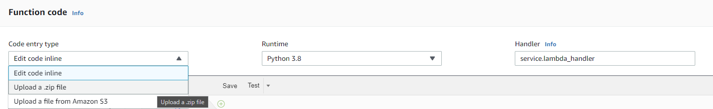
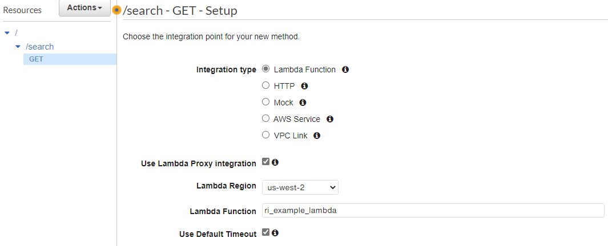

# Creating a New Fetch Microservice
## 1. Lambda Function
Create a Lambda function that uses Python 3

 Every microservice has a main file: **service.py**, that has these two core functions:
```
def respond(err, res=None)
def lambda_handler(event, context)
```
The main code and dependencies for the Lambda function should be zipped and uploaded via this method.  Also,  note that **Handler** field is in the format of **main_filename.main_function_name**



## 4. API Gateway
If it doesn't already exist, create an API Gateway and a new resource. Then, create a new method for the resource with the integration type set to Lambda Function.


##
You can now test the API gateway and get an HTTP 200 response with body if everything went well.
